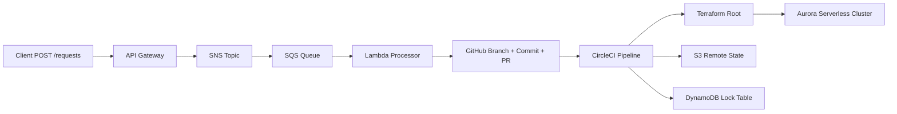

# Aurora Serverless Request-Driven Provisioning Platform

> A production-style cloud automation project that lets users request a new Aurora environment through an API, automatically opens a GitHub Pull Request with the infrastructure change, and provisions the database through Terraform and CircleCI.

## Why this project stands out

This project is more than a basic infrastructure demo. It shows an end-to-end workflow that combines:

- **Serverless request intake** with API Gateway, SNS, SQS, and Lambda
- **Infrastructure as Code** with modular Terraform
- **Secure CI/CD authentication** using CircleCI OIDC instead of long-lived AWS keys
- **Automated GitOps-style change creation** by generating request-specific `.tfvars` files and opening Pull Requests automatically
- **Aurora Serverless provisioning** with different sizing logic for `dev` and `prod`
- **Operational thinking** with DLQ support, remote Terraform state, state locking, KMS encryption, SSM parameters, and private subnets

For a junior DevOps / Cloud / Platform / SRE candidate, this is exactly the kind of project that signals systems thinking rather than isolated scripting.

---

## What it does

A user sends a simple API request with:

- `database_name`
- `database_engine` (`mysql` or `postgresql`)
- `environment` (`dev` or `prod`)

The platform then:

1. Accepts the request through **API Gateway**
2. Pushes it through **SNS** into **SQS**
3. Processes it in **Lambda**
4. Validates the payload
5. Creates a request-specific Terraform variables file under `requests/<env>/`
6. Opens a **GitHub Pull Request** automatically
7. Lets **CircleCI** pick up the change
8. Runs **Terraform** to provision the Aurora environment in AWS

---

## Architecture



### Main building blocks

**Serverless layer**
- API Gateway for request intake
- SNS topic for decoupled fan-out entry point
- SQS queue with DLQ for resilient asynchronous processing
- Lambda for validation and GitHub automation

**Terraform layer**
- Remote backend with S3 + DynamoDB
- Root stack for VPC, KMS, SSM, and module orchestration
- Reusable `rds-cluster` module for Aurora resources

**CI/CD layer**
- CircleCI pipeline
- OIDC-based AWS authentication
- SAM deployment + Terraform apply

---

## Key technical highlights

### Request-driven infrastructure
Instead of manually editing Terraform every time, a user submits a request through an API and the system generates the infrastructure change automatically.

### GitHub automation from Lambda
The Lambda function reads a GitHub token from SSM Parameter Store, creates a branch, writes a `.tfvars` request file, commits it, and opens a Pull Request.

### Secure CI/CD with OIDC
CircleCI authenticates to AWS using an IAM role and web identity trust, avoiding static AWS access keys.

### Remote Terraform state done properly
Terraform state is stored in S3 with DynamoDB locking, which is much closer to real team workflows.

### Separation between `dev` and `prod`
The input payload includes an environment field that influences Aurora sizing behavior.

### Good cloud hygiene
The project includes private subnets, KMS encryption, SSM parameters, dead-letter handling, example config files, and a modular Terraform structure.

---

## Repository structure

```text
.
├── config/
│   └── .env.example
├── server_less/
│   ├── samconfig.toml.example
│   ├── template.yaml
│   └── src/
│       ├── handler.py
│       └── requirements.txt
├── .circleci/
│   └── config.yml
└── IaC_Code/
    ├── backend/
    │   └── main.tf
    ├── oidc_circleCI/
    │   ├── backend.tf
    │   ├── init.sh
    │   ├── oidc.tf
    │   └── terraform.tfvars.example
    ├── root/
    │   ├── backend.tf
    │   ├── data.tf
    │   ├── init.sh
    │   ├── locals.tf
    │   ├── main.tf
    │   ├── outputs.tf
    │   ├── providers.tf
    │   ├── ssm.tf
    │   ├── variables.tf
    │   └── vpc.tf
    └── modules/
        └── rds-cluster/
            ├── locals.tf
            ├── main.tf
            ├── outputs.tf
            ├── variables.tf
            └── versions.tf
```

---

## Quick start

### Prerequisites
Before you run the project, make sure you already have:

- **AWS CLI** installed and configured
- **AWS SAM CLI** installed
- **Terraform** installed
- A **CircleCI project** connected to your GitHub repository
- A **GitHub Personal Access Token** with permissions to create branches, commits, and pull requests

That is the main setup barrier. After that, the flow is straightforward.

### Setup flow

**1. Deploy the serverless stack**

```bash
cd server_less
sam build
sam deploy
```

This creates the request API, SNS, SQS, DLQ, Lambda, and IAM resources.

**2. Store your GitHub token in SSM**

```bash
aws ssm put-parameter \
  --name "/aurora-serverless/github/token" \
  --type "SecureString" \
  --value "<your-github-token>"
```

**3. Deploy the Terraform backend**

```bash
cd IaC_Code/backend
terraform init
terraform apply
```

**4. Deploy the CircleCI OIDC infrastructure**

```bash
cd IaC_Code/oidc_circleCI
./init.sh
terraform apply
```

**5. Configure CircleCI environment variables**

Set the required variables in CircleCI, especially:

- `AWS_ROLE_ARN`
- `AWS_REGION`
- `SAM_STACK_NAME`
- `PROJECT_NAME`
- `GITHUB_OWNER`
- `GITHUB_REPO`
- `GITHUB_BASE_BRANCH`
- `GITHUB_TOKEN_PARAMETER_NAME`
- `TERRAFORM_ROOT_PATH`

**6. Send a provisioning request**

Use the API Gateway URL from the SAM stack outputs and send:

```json
{
  "database_name": "myappdb",
  "database_engine": "mysql",
  "environment": "dev"
}
```

That request will generate a Terraform request file, open a GitHub PR, and trigger the provisioning workflow.

---

## Example request

```bash
curl -X POST "https://<api-id>.execute-api.<region>.amazonaws.com/api/requests" \
  -H "Content-Type: application/json" \
  -d '{
    "database_name": "ordersdb",
    "database_engine": "postgresql",
    "environment": "prod"
  }'
```

---

## Security and operations notes

This project includes several practices that make it feel closer to a real platform workflow:

- **OIDC authentication** for CircleCI
- **SSM Parameter Store** for GitHub token retrieval
- **KMS encryption** for database-related resources
- **Private subnet placement** for the Aurora cluster
- **DLQ support** for failed queue processing
- **Remote Terraform state** with locking
- **Example configuration files** instead of committing real secrets

---

## What I would improve next

If this project were continued further, strong next steps would be:

- add approval / review gates before provisioning `prod`
- validate request uniqueness and naming policy more strictly
- add observability dashboards and alarms
- add automated tests for the Lambda request processor
- support request cancellation / lifecycle management
- add a frontend portal for submitting database requests

---

## Who this project is for

This project is a strong portfolio piece for roles such as:

- Junior DevOps Engineer
- Cloud Engineer
- Platform Engineer
- SRE / Production Engineering internships or junior roles
- Backend / Infrastructure-oriented software roles

It demonstrates cloud design, automation, CI/CD, IAM, Terraform structure, and practical AWS thinking in one coherent flow.

---

## Author

**Nerya Reznikovich**

If you want, you can extend this README with screenshots, architecture diagrams, pipeline output examples, and a short demo GIF to make it even more recruiter-friendly.